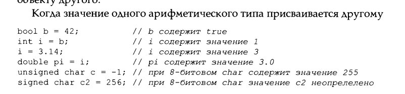
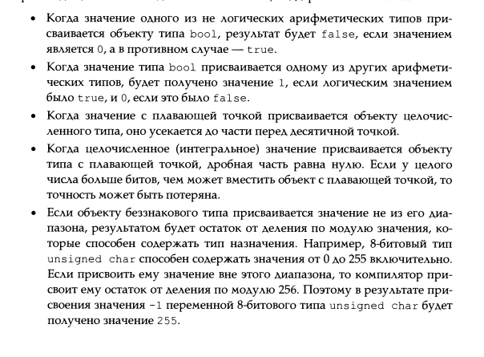
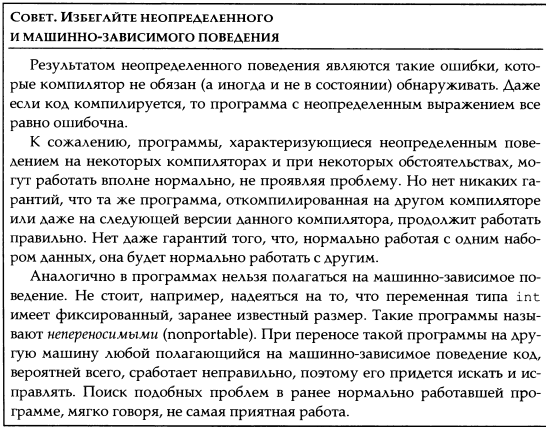
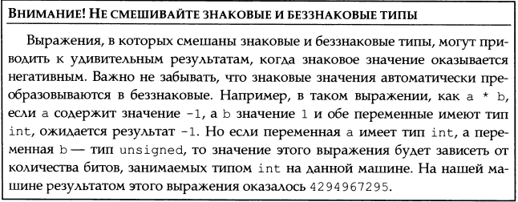

72
В С++ определен набор базовых типов: Арифметические типы и спец тип void.

Есть две разновидности арифм.типов: целочисленные(включай символьные и логические) и с плавающей запятой.

bool - true of false.

Остальные символьные типы, wchar_t, char16_t и char32_t, используют- ся для расширенных наборов символов. Тип wchar_t будет достаточно боль- шим, чтобы содержать любой символ в наибольшем расширенном наборе символов машины. Типы char16_t и char32_t предназначены для символов Unicode. (Unicode это стандарт для представления символов, используемых, по существу, в любом языке.)

Типы с плавающей точкой представляют значения с одиночной, двойной и расширенной точностью. Стандарт определяет минимальное количество значащих цифр. Большинство компиляторов обеспечивает большую точность, чем минимально определено стандартом. Как правило, тип float представляется одним словом (32 бита), тип double - двумя словами (64 бита), а тип long double - тремя или четырьмя словами (96 или 128 битов). Типы float и double обычно имеют примерно по 7 и 16 значащих цифр соответственно. Тип long double зачастую используется для адаптации чисел с плавающей запятой аппаратных средств специального назначения; его точность, вероятно, также зависит от конкретной реализации этих средств.

        Знаковые и беззнаковые типы 
За исключением типа bool и расширенных символьных типов целочисленные типы могут быть знаковыми (signed) или беззнаковыми (unsigned). Знаковый тип способен представлять отрицательные и положительные числа (включая нуль); а беззнаковый тип - только положительные числа и нуль.

Типы int, short, long и long long являются знаковыми. Соответствующий беззнаковый тип получают добавлением части unsigned к названию такого типа, например unsigned long. Тип unsigned int может быть сокращен до unsigned.

В беззнаковом типе все биты представляют значение. Например, 8-битовый тип unsigned char может содержать значения от 0 до 255 включительно 8-битовый тип signed char rарантированно будет содержать значения от 127 до 127

        Преобразование типов

Преобразование типов происходит автоматически, когда объект одного типа используется там, где ожидался другого типа.

bool b = 42; // b содержит true
int i = b; /// i содержит 1
i = 3.14; // i содержит 3
double pi = i;// pi содержит 3.0

                Выражения, задействующие беззнаковые типы
Если использовать значение типа unsigned и int в арифметическом выражении, значения типа int преобразуются в unsigned
unsigned u = 10;
int i = -42;
cout << i + i; // выводит -84
cout << u+i; // при 32 битовом int, выводит 4294967264

Прежде чем будет осуществлено сложение, значение -42 типа int пребразуется в unsigned. Преобразование отрицательного числа в тип unsigned происходит точно так же, Как и при попыте присвоить отриц. знач. объекту типа Unsigned. Произойдёт "обращение значение" (Wrap around) -  описывает поведение, когда числовая переменная достигает своего максимального или минимального значения и "перескакивает" к противоположному концу диапазона. Представьте себе циклический счётчик: когда он доходит до своего максимума, он не увеличивается дальше, а возвращается к своему минимальному значению.

Тот факт, что беззнаковый объект не может быть меньше нуля, влияет на способы написания циклов. Например, в упражнениях раздела 1.4.1 (стр. 39) следовало написать цикл, который использовал оператор декремента для вывода чисел от 10 до 0. Написанный вами цикл, вероятно, выглядел при- мерно так:
    for (int i = 10; i >=0; --i)
    cout << i << endl;
Переписав цикл, заменив на unsigned - цикл станет бесконечный.
    for (unsigned i = 10; i >=0; --i)
    cout << i << endl;

Рассмотрим, что будет, когда u станет равно 0. На этой итерации отображается значение 0, а затем выполняется выражение цикла for. Это выражение, --u, вычитает 1 из u. Результат, -1, недопустим для беззнаковой переменной. Как и любое другое значение, не попадающее в диапазон допустимых, это будет преобразовано в беззнаковое значение. При 32-разрядном типе int результат выражения и при и равном 0 составит 4294967295.
Исправить этот код можно, заменив цикл for циклом while, поскольку последний осуществляет декремент прежде (а не после) отображения значения:

   unsigned v = 11;

    while (v > 0) {
        --v;
        cout << v << endl;
    }
Цикл начинается с декремента значения управляющей переменной цикла. В начале последней итерации переменная и будет иметь значение 1, а после декремента мы отобразим значение 0. При последующей проверке условия цикла while значением переменной и будет 0, и цикл завершится. Поскольку декремент осуществляется сначала, переменную и следует инициализировать значением на единицу больше первого подлежащего отображению значения. Следовательно, чтобы первым отображаемым значением было 10, перемен- ную и инициализируем значением 11.

                Литералы